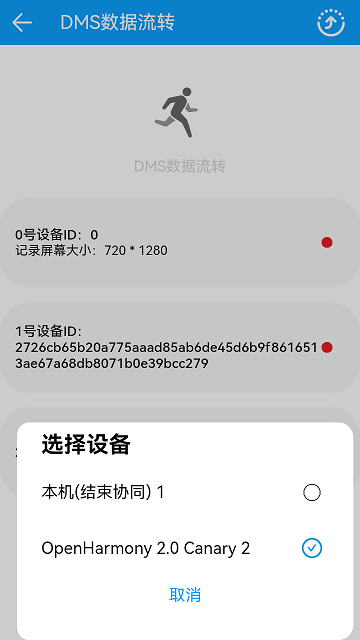
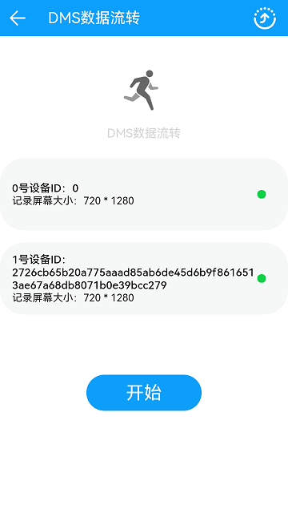

# 分布式跑马灯

### 概要简介

本示例使用分布式对象实现了分布式跑马灯功能。实现效果如下：

  

### 相关概念

分布式跑马灯:该示例使用分布式对象实现多台设备之间的数据同步，需配置数据同步权限。应用启动后，创建分布式对象，通过相同的sessionId来确保多设备之间的协同，通过路径动画animateTo中onFinish方法实现动画播放完成后对分布式对象的数据进行增加，通过分布式对象的on('change')方法实现监听分布式对象的变更，从而实现分布式跑马灯。

### 相关权限

允许不同设备间的数据交换：ohos.permission.DISTRIBUTED_DATASYNC

### 使用说明

1.进入应用，先进行权限授权，退出应用。再进入应用，主设备上点击右上角流转按钮，在弹窗列表选择需要组网的设备，进行设备认证，若设备间已认证，此步骤可省略。

2.设备均已认证，在主设备上点击右上角流转按钮，弹窗后点击**取消**按钮或点击任意地方，已认证的设备会显示出来。

3.已认证设备显示后，点击**开始**按钮，主设备会依次拉起已认证设备进行动画播放，动画跑完以后会上报屏幕分辨率到主设备并显示。

### 约束与限制

1.本示例仅支持在标准系统上运行。

2.本示例为Stage模型，从API version 9开始支持。

3.本示例需要使用DevEco Studio 3.0 Beta4 (Build Version: 3.0.0.991, built on July 6, 2022)才可编译运行。

4.本示例需所有设备进行授权后退出一次再重新进入应用，所有认证设备（含主设备）均需在线，否则该示例无法正常运行。

5.本示例动画运行结束之后，若要再次运行，需杀掉应用，重新打开才可再次运行。